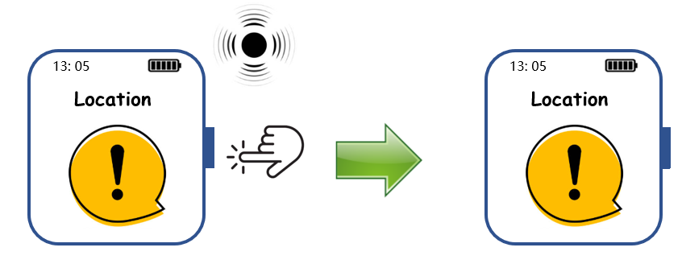

For the Phase-1 presentation, I design an application scenario of health monitoring. I also draw the cartoon picture of the storyboard. 

For the Phase-2 presentation, I'm responsible for designing user interface and interaction model of areas with exposure risks, drawing the prototype of the function of  avoidance of areas with exposure risks

I also wrote the scripts of our video, shot the video, and finally edited the video. This video work is done by me together with Shu Xinyue. 

After all, we all contributed to the discussion and brain storm of the basic idea and design of our application. 